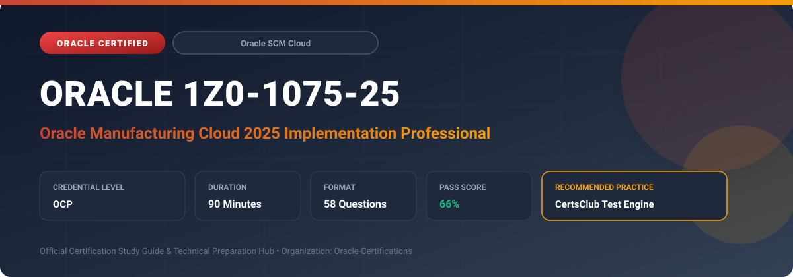

  

# Oracle 1Z0-1075-25: Oracle Manufacturing Cloud 2025 Implementation Professional

---

## 1. Exam Overview & Candidate Profile

The **Oracle 1Z0-1075-25: Oracle Manufacturing Cloud 2025 Implementation Professional** examination is engineered for enterprise architects, solution specialists, functional consultants, and implementation professionals seeking formal industry recognition of their proficiency in Oracle technologies.

The Oracle Manufacturing Cloud 2025 Implementation Professional (1Z0-1075-25) certification validates technical competence in implementing Oracle Discrete and Process Manufacturing Cloud solutions. Candidates demonstrate mastery of plant parameters, work centers, standard operations, work definitions, work order generation, execution dispatch, and shop floor material/resource reporting.

### Target Audience & Prerequisites
- **Target Roles**: Implementation Specialists, Cloud Architects, Technical Leads, Enterprise Functional Consultants, and Systems Engineers.
- **Recommended Experience**: 1–2 years of practical, hands-on experience designing, implementing, and maintaining corresponding Oracle Cloud solutions.
- **Credential Earned**: Oracle Certified Professional (OCP).

---

## 2. Key Exam Specifications

| Specification | Details |
| :--- | :--- |
| **Exam Code** | **Oracle 1Z0-1075-25** |
| **Official Title** | Oracle Manufacturing Cloud 2025 Implementation Professional |
| **Certification Track** | Oracle Supply Chain Management Cloud |
| **Exam Duration** | 90 Minutes |
| **Number of Questions** | 58 Questions |
| **Passing Score** | 66% |
| **Question Format** | Multiple Choice (Single/Multiple Answer), Scenario-Based Questions |
| **Delivery Provider** | Oracle University / Pearson VUE (Online Proctored or Test Center) |
| **Recommended Practice Engine** | [CertsClub Oracle Practice Tests](https://www.certsclub.com/oracle/1z0-1075-25-dumps.html) |

---

## 3. Official Blueprint & Exam Domain Breakdown

The examination assesses candidate competencies across core functional domains weighted as follows:

| Domain Area | Weighting |
| :--- | :--- |
| **Manufacturing Plant Setup & Work Center Configuration** | `20%` |
| **Work Definitions, Operations, & Item Structures** | `25%` |
| **Work Order Management & Production Scheduling** | `25%` |
| **Shop Floor Execution, Dispatch Console & Material Reporting** | `15%` |
| **Manufacturing Exceptions, Quality, & Cost Integration** | `15%` |

---

## 4. Deep Dive into Complex & Challenging Technical Topics

To secure a passing score on the 1Z0-1075-25 exam, candidates must master the following advanced concepts:

- Plant parameter setup, resource and resource instance definitions, and work center capacity allocation.
- Designing standard operations, work definitions, operation yields, component allocation, and phantom assemblies.
- Work order release automation, dispatch console optimization, and backflush vs. manual push component issuance.
- Contract manufacturing and outside processing (OSP) integration with Purchasing and Cost Management.

---

## 5. Scenario-Based Demo & Practice Questions

### Question 1
When creating a Work Definition in Oracle Manufacturing Cloud, an engineer wants subassemblies to be consumed directly on the shop floor without generating separate inventory stocking work orders. What item attribute or structure type must be configured?

A) Serial Tracked Component
B) Phantom Assembly Structure
C) Outside Processing Component
D) Lot-Controlled Finished Good

- **Correct Answer**: `B) Phantom Assembly Structure`  
- **Technical Explanation**: Phantom assemblies allow intermediate subassemblies to be exploded directly into their lower-level components on the parent work order, avoiding independent work orders and stocking steps.

---

### Question 2
Which shop floor transaction automatically relieves inventory for required components upon completion of an operation without requiring manual picking or issue transactions?

A) Manual Material Issue
B) Component Backflush
C) Movement Request Transfer
D) Subinventory Return

- **Correct Answer**: `B) Component Backflush`  
- **Technical Explanation**: Operation completion with backflush enabled automatically deducts required component quantities from designated supply subinventories based on the work definition bill of materials.

---

## 6. Recommended Preparation Strategy & Practice Testing Engine

Achieving certification in **Oracle 1Z0-1075-25** requires balanced theoretical study and scenario-based simulation practice:

1. **Review Oracle Documentation**: Master architecture guides, implementation workbooks, and administration manuals on the Oracle Help Center.
2. **Hands-on Lab Practice**: Execute real-world configuration, policy setup, and troubleshooting tasks in your cloud tenancy or test instance.
3. **Simulated Exam Drills**: Practice answering timed, scenario-based multiple-choice questions to familiarize yourself with the question formats, traps, and timing constraints.

### Practice With CertsClub
For realistic practice questions, updated dumps, and mock testing environments:
- **Resource**: [CertsClub Oracle Practice Test Engine](https://www.certsclub.com/oracle/1z0-1075-25-dumps.html)
- **Special Discount**: Use coupon code **`club20`** during checkout for an instant **20% discount** on all practice exam bundles and testing engines.

---

## 7. Official Documentation & References

- [Oracle University Certification Registry](https://education.oracle.com/)
- [Oracle Help Center Documentation Portal](https://docs.oracle.com/)
- [Oracle Cloud Infrastructure & Applications Guides](https://docs.oracle.com/en/cloud/)
- [CertsClub Oracle Certification Exam Practice](https://www.certsclub.com/oracle/1z0-1075-25-dumps.html)

---

## 8. SEO & Discovery Keywords

`oracle 1z0-1075-25, oracle 1z0-1075-25 exam, oracle 1z0-1075-25 dumps, 1Z0-1075-25 practice questions, 1Z0-1075-25 study guide, oracle 1z0-1075-25 syllabus, oracle manufacturing cloud 2025 implementation professional, certsclub 1z0-1075-25`
